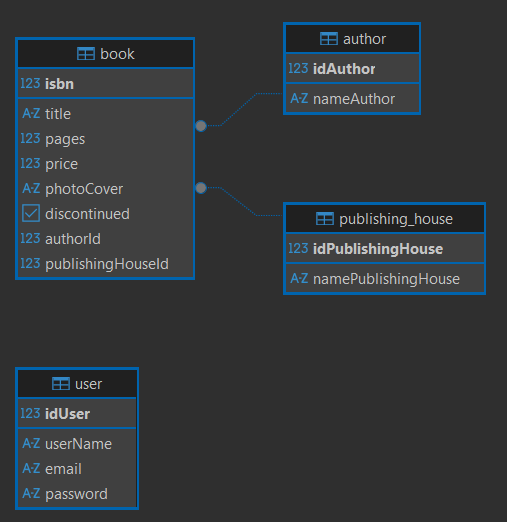
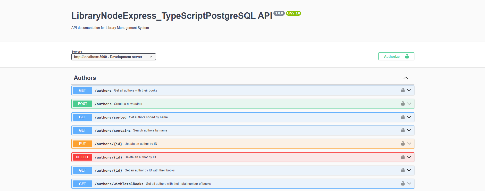
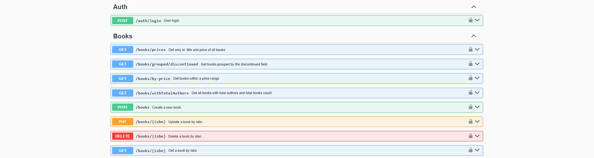
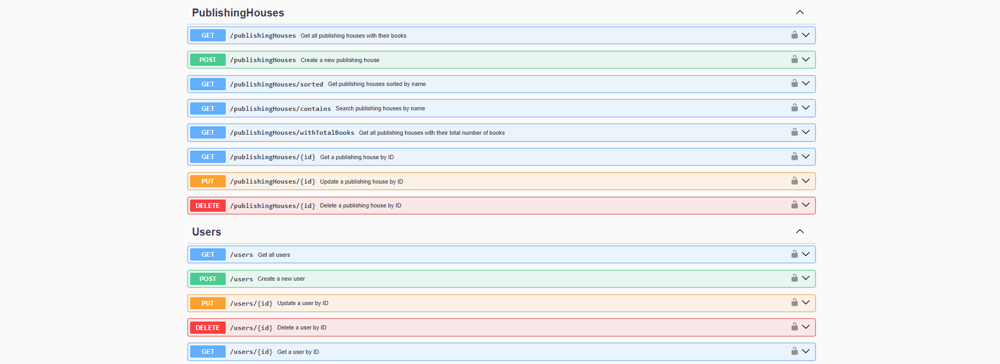

## LibraryNodeExpress_TypeScriptPostgreSQL

**LibraryNodeExpress_TypeScriptPostgreSQL** is an NodeJS + Express API that manages library-related information, including authors, books, and publishing houses, as well as handling user authentication and logging actions performed on the system.

LibraryNodeExpress_TypeScriptPostgreSQL/  
├── src/    
│   ├── controllers/   
│   │      ├── authController.ts   
│   │      ├── authorController.ts  
│   │      ├── bookController.ts  
│   │      ├── publishingHouseController.ts  
│   │      └── userController.ts  
│   ├── db/   
│   │      └── conection.ts   
│   ├── models/  
│   │      ├── authorModel.ts   
│   │      ├── bookModel.ts  
│   │      ├── publishingHouseModel.ts  
│   │      └── userModel.ts  
│   ├── routes/   
│   │      ├── authRoutes.ts   
│   │      ├── authorRoutes.ts  
│   │      ├── bookRoutes.ts  
│   │      ├── publishingHouseRoutes.ts  
│   │      └── userRoutes.ts  
│   ├── app.ts  
│   └── index.ts   
├── .env  
├── package.json  
├── tsconfig.json

## connection.ts
```ts 
export const AppDataSource = new DataSource({
  type: "postgres",
  host: process.env.DB_HOST || 'localhost',
  port: parseInt(process.env.DB_PORT || '5432', 10),
  username: process.env.DB_USERNAME || 'postgres',
  password: process.env.DB_PASSWORD,
  database: process.env.DB_NAME || 'library',
  schema: process.env.DB_SCHEMA || 'public',
  logging: process.env.NODE_ENV !== 'production',
  entities: [Author, Book, PublishingHouse, User],
  synchronize: process.env.NODE_ENV !== 'production',
});
``` 






[DeepWiki moraisLuismNet/LibraryNodeExpress_TypeScriptPostgreSQL](https://deepwiki.com/moraisLuismNet/LibraryNodeExpress_TypeScriptPostgreSQL)